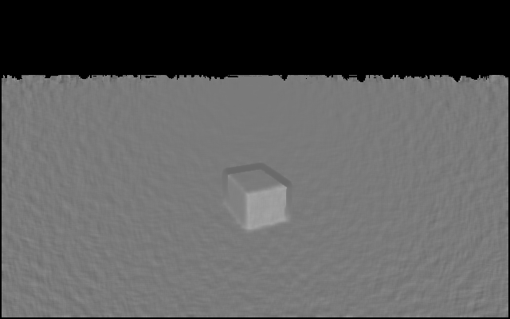

# boxrange

Measure the distance to a box from depth camera input.

Depth frame in, tracked metric distance out, ~30 FPS on a laptop CPU. No
training, no CAD model, no GPU. Runs on the AgiBot X2's head RGB-D camera and on
RealSense D400 cameras.


## What it does

Finds box-shaped objects sitting on a floor and reports how far away they are,
with an uncertainty and a confidence score. Per frame it fits the ground plane,
isolates what stands on it, fits an oriented box, and measures the distance —
then tracks boxes across frames so a static box doesn't jitter.

Because "distance to a box" is ambiguous, four numbers come back:

| field | meaning | use for |
|---|---|---|
| `surface_m` | Euclidean, camera to nearest point on the box | collision, stopping distance |
| `axial_m` | nearest box surface along +z | forward-driving robots |
| `centroid_m` | Euclidean to box centre | grasping, planner targets |
| `measured_m` | robust nearest observed depth, model-free | cross-check on the fit |

Plus `sigma_m` (1-sigma), `confidence` (0–1), `visible_faces`, and the fitted
box pose and extents.

## Run it on your computer

No camera needed — a synthetic source renders a box with a modelled stereo
noise profile.

```bash
uv pip install -e ".[dev]"
python -m boxrange --selftest
```

`--selftest` places a box at known distances, measures each, and checks the
answer against truth. Exit code 0 on pass, so it works in CI.

```bash
python -m boxrange --frames 30 --distance 2.0
python -m boxrange --frames 0 --distance 2.0 --show
python -m boxrange --frames 5 --distance 2.5 --json
```

`--distance` sets the box *centre*; the pipeline reports distance to the
nearest *face*, so the two differ. The CLI prints the true face distance for
comparison. Also try `--yaw`, `--box-size`, `--no-noise`.

## Run it on the AgiBot X2

The X2's depth sensor is an **Orbbec Gemini 335 in the head**, front-facing:
depth up to 1280x800 @ 30 fps, 90 deg x 65 deg, 50 mm baseline, 0.10-20 m range
with an optimal band of 0.26-3 m, and a spatial precision spec of <=1.5% at 2 m.
(The chest carries the LiDAR and an IMU, not the depth camera.)

**On the robot, reach it through the X2's own ROS 2 interface, not over USB.**
The AIMDK stack owns the device, and a USB camera has exactly one owner.

### Getting it running

The X2 runs Ubuntu 22.04 with ROS 2 Humble. Run this either on the robot's
onboard compute, or on a laptop on the same network — ROS 2 discovery makes both
work, and the laptop is the nicer place to iterate.

**1. Copy the package over** (skip if you are on a dev machine already):

```bash
scp -r boxrange pyproject.toml README.md <user>@<robot-host>:~/boxrange/
```

**2. Create the venv so it can see `rclpy`.** This is the step that goes wrong.
`rclpy` is not on PyPI — it ships with ROS 2 in the system Python, so a normal
venv cannot import it and `--source x2` fails with "rclpy not found" even though
ROS 2 is installed correctly:

```bash
source /opt/ros/humble/setup.bash
cd ~/boxrange
python3 -m venv --system-site-packages .venv    # the flag is the point
source .venv/bin/activate
pip install -e .
```

If `pip install -e .` wants to build OpenCV from source (slow on ARM), ROS
already provides it — use the system one instead:

```bash
sudo apt install python3-opencv python3-numpy
pip install -e . --no-deps
```

**3. Check the environment before blaming the code:**

```bash
echo $ROS_DOMAIN_ID                  # must match the robot's; unset means 0
ros2 topic list | grep rgbd_head     # are the topics advertised at all
ros2 topic hz /aima/hal/sensor/rgbd_head_front/depth_image
```

If `ros2 topic list` shows nothing from a dev machine, it is almost always
`ROS_DOMAIN_ID` or the two hosts not being on the same subnet.

**4. Probe, then run:**

```bash
python -m boxrange --probe                 # lists topics, then actually subscribes
python -m boxrange --source x2 --show      # live overlay
python -m boxrange --source x2 --json      # one JSON record per detection
```

`--probe` is worth running first every time: it separates "no ROS 2", "topics
not advertised", and "advertised but nothing arrives" (a QoS mismatch), which
otherwise all look like a dead pipeline.

**5. Confirm the depth encoding once.** The docs do not state it, and the code
refuses to guess:

```bash
ros2 topic echo --once --field encoding /aima/hal/sensor/rgbd_head_front/depth_image
```

`16UC1` or `mono16` means millimetres, `32FC1` means metres. Both are handled;
anything else raises with the topic name in the message.

### Iterating without tying up the robot

Record on the robot, analyse anywhere. This is the fastest loop, and it means
tuning against a *fixed* scene instead of a live one:

```bash
# on the robot
python -m boxrange --source x2 --record run.npz --frames 200

# anywhere
python -m boxrange --source npz --path run.npz --json > ranges.jsonl
python -m boxrange --source npz --path run.npz --show
```

The `.npz` carries the intrinsics, so replayed results are identical to live
ones.

### Using it as a library

```python
from boxrange import BoxRangePipeline, X2RgbdSource

pipeline = BoxRangePipeline()
with X2RgbdSource() as source:          # subscribes; blocks for CameraInfo
    for frame in source:
        for det in pipeline.process(frame):
            print(det.range.surface_m, det.range.sigma_m, det.range.confidence)
```

`X2RgbdSource` spins its own node and pumps callbacks from the iterator, so
there is no background thread and no executor to manage. If your application
already called `rclpy.init()`, it detects that and leaves your context alone on
close.

Topics used, from the AIMDK sensor interface docs, at 30 Hz:

| topic | type | used for |
|---|---|---|
| `/aima/hal/sensor/rgbd_head_front/depth_image` | `sensor_msgs/Image` | the measurement |
| `/aima/hal/sensor/rgbd_head_front/depth_camera_info` | `sensor_msgs/CameraInfo` | intrinsics |
| `/aima/hal/sensor/rgbd_head_front/rgb_image` | `sensor_msgs/Image` | overlay only, off by default |

Intrinsics come from `depth_camera_info`, so nothing is guessed from a
datasheet except the stereo baseline, which `CameraInfo` does not carry.

Three things that bite here, all of which fail silently:

- **Depth units are not in the docs.** ROS publishes depth as `16UC1` in
  *millimetres* or `32FC1` in *metres*. `decode_depth_image` reads
  `msg.encoding` and refuses anything else rather than defaulting — guessing is
  a factor of 1000, and because every threshold scales with the noise model the
  symptom is an empty detection list, not an absurd number.
- **QoS.** The subscription is BEST_EFFORT by default. A RELIABLE subscriber
  against a BEST_EFFORT publisher is an incompatible pair and receives
  *nothing*, with no error — the most common way a ROS 2 camera looks dead. The
  docs say these topics publish RELIABLE, so `--ros-reliable` gets you the
  matching pair if you want the delivery guarantee.
- **Row stride.** `msg.step` is a byte stride and need not equal
  `width * itemsize`. Reshaping by width alone shears the image, which the plane
  fit happily interprets as a tilted floor and reports with high confidence.

`--probe` lists the advertised topics *and* then actually subscribes, because
advertised is not the same as receivable — that is exactly the QoS trap above.

### Off the robot

A Gemini 335 on a bench, over USB:

```bash
pip install -e ".[orbbec]"
python -m boxrange --source orbbec --show
```

Note Orbbec's `get_depth_scale()` returns **millimetres** per unit while the
identically named RealSense call returns *metres*; the conversion is confined to
`CameraIntrinsics.from_orbbec` and has its own test.

Or with no camera at all — the preset models the sensor so results transfer:

```bash
python -m boxrange --camera gemini335 --selftest
python -m boxrange --camera gemini335 --distance 2.0 --show
```

Depth-only is the right mode throughout. Aligning depth into the Gemini's colour
frame trims the field of view from 90x65 to the colour camera's 86x55 and
resamples depth exactly at the discontinuities segmentation keys on.

**Extrinsics are not published**, so every distance here is in the depth optical
frame (+x right, +y down, +z forward). Ranging does not need them — the ground
plane is fitted from depth — but putting a distance into the robot's base frame
does; read it from the robot's TF tree rather than hardcoding.

## Run it with a RealSense

```bash
pip install -e ".[realsense]"
python -m boxrange --source live --show
```

Record on the machine with the camera, analyse anywhere:

```bash
python -m boxrange --source live --record run.npz --frames 200
python -m boxrange --source npz --path run.npz --json
python -m boxrange --source bag --path scene.bag --json > ranges.jsonl
```

```python
from boxrange import BoxRangePipeline, RealSenseSource

pipeline = BoxRangePipeline()
with RealSenseSource(color=False) as source:
    for frame in source:
        for det in pipeline.process(frame):
            print(det.range.surface_m, det.range.sigma_m, det.range.confidence)
```

**Use `color=False` for pure ranging.** Enabling colour aligns depth into the
colour frame, which crops depth FOV from roughly 87°×58° to 69°×42° and
resamples depth at exactly the discontinuities segmentation depends on. Colour
is never used for measurement — only for the overlay background and as input to
an optional learned detector.

`pyrealsense2` has no wheel for macOS arm64, so it's an optional extra. The
synthetic and `.npz` paths run anywhere.

## FoundationPose from depth alone

There is an alternative engine that gets the distance from [NVlabs
FoundationPose](https://nvlabs.github.io/FoundationPose/) instead of from the
geometric fit, driven by depth with no colour camera involved.

**FoundationPose has no depth-only mode.** Both of its networks take a
six-channel input built as `cat([rgb_crop, xyz_crop], dim=1)` — once for the
rendered hypothesis and once for the observation — and `register(K, rgb, depth,
ob_mask)` and `track_one(rgb, depth, K)` both take `rgb` positionally and warp
it before anything else runs. Passing `None` is a crash, not a degraded mode.

So depth-only here means *substituting* the colour channel, not omitting it, and
the substitution is chosen rather than improvised. The rendered branch draws an
untextured mesh with `use_light=True`, which in `Utils.nvdiffrast_render` is

```
I = clip(albedo * (0.8 + 0.5 * clip(-n_z, 0, 1)), 0, 1)
```

— a shading map and nothing else, no texture, background black. The closest
achievable match for the observation branch is the same formula evaluated on
normals estimated from depth, which is what `depth_to_pseudo_rgb` computes. Both
branches then live in the same domain, which is the property render-and-compare
depends on.



The other two inputs come from depth too. The **mask** normally comes from SAM
or Mask R-CNN on the colour image; here it comes from the plane-and-cluster
segmentation this package already has. The **CAD model** for a cuboid is its
three side lengths, so nothing has to be authored — pass `--box-extents`, or let
it be taken from the depth fit on the first frame.

```bash
# needs CUDA, nvdiffrast, and FoundationPose's weights on PYTHONPATH
python -m boxrange --source orbbec --engine foundationpose --box-extents 0.4 0.3 0.25

# check the plumbing without a GPU (this does NOT run FoundationPose)
python -m boxrange --camera gemini335 --engine foundationpose-stub --json

# eyeball what the network is actually being fed
python -m boxrange --camera gemini335 --save-pseudo-rgb pseudo.png
```

### What it costs

**Translation survives it; rotation and the score do not.** FoundationPose seeds
translation from `guess_translation`, which is pure depth and mask, and refines
it against the XYZ half of the input — the RGB half mostly disambiguates
*rotation*. Distance is a translation question, and a cuboid's rotation is only
recoverable up to its own symmetry anyway, so this particular task loses little.
The pose *score* is a different matter: the scorer was trained on real imagery,
a shading map is out of distribution for it, and it should be read as ordinal
within a frame rather than as a calibrated confidence. The confidence on a
`PoseResult` comes from geometric agreement between the returned pose and the
observed points instead.

**The shading map has a working range.** Normals from stereo depth are noisy —
a raw central difference at 1.6 m is 52 deg of median error, i.e. pure noise, so
the estimator smooths first. Even smoothed, measured against analytic normals
with the Gemini 335 noise model:

| range | 1.0 m | 1.6 m | 2.5 m | 3.5 m |
|---|---|---|---|---|
| median normal error | 3.1° | 5.9° | 10.9° | 19.8° |

which is to say the substituted colour channel carries real signal roughly
inside the Gemini 335's own optimal band of 0.26–3 m, and washes toward flat
grey past it. Look at `--save-pseudo-rgb` output before trusting a result; if it
is featureless, only the depth half of the network's input is real.

**And for a box on a floor this is the expensive way to get the answer.** The
geometric engine needs no GPU, no mesh and no network, and measures the same
distance more accurately. Reach for this one when you want FoundationPose's
actual strengths — full 6D pose of a specific known object, heavy occlusion,
telling apart objects a plane fit cannot — and want them without a colour
stream.

Both engines emit the same JSON schema with an `engine` field, so their outputs
are directly comparable and a stub run cannot be mistaken for a real one.

## Why it works

**Depth measures range directly.** A box is a cuboid primitive and the sensor
already observes distance, so geometry beats regressing it from RGB — no
training data, no CAD model, no labels.

**The box fit is plane-constrained.** Free 3D PCA is the obvious approach and
it's wrong: a depth camera sees only one or two faces, so the point mass is a
hollow L-shell and the principal axes tilt off the true edges. Locking one axis
to the ground normal and recovering the other two from the footprint's
minimum-area rectangle gets the true edge directions from a single visible
corner.

**Every threshold scales with the sensor noise model, not absolute
millimetres.** Stereo error grows as z², so a 5.7 cm residual is terrible at
1 m and textbook-perfect at 3.5 m where the noise floor *is* 5 cm. Clustering
tolerance, face tolerance, and confidence all derive from `range_sigma(z)`.
An earlier absolute-threshold version scored distance as if it were error and
silently dropped every detection past 2.5 m.

**Uncertainty is reported, not hidden.** Always read `sigma_m` — a box at 4 m
carries ~16× the variance of one at 1 m.

## Accuracy and limits

Against synthetic scenes with exact ground truth (0.40 × 0.30 × 0.25 m box):

| camera | 1 m | 1.9 m | 2.8 m | 3.8 m | modelled sigma at 3 m |
|---|---|---|---|---|---|
| D435, 640×480 | −7 mm | −26 mm | −58 mm | −95 mm | ±37 mm |
| Gemini 335 (X2 head), 640×400 | −13 mm | −47 mm | −85 mm | −158 mm | ±68 mm |

The X2's camera reads about 1.5× further near, because its modelled range noise
is roughly 3× a D435's at the same distance and this bias is driven by that
noise. **Do not carry the D435 numbers over to the robot.** Run
`--selftest --camera gemini335` for the full table.

Two limits worth knowing:

- **The error is a bias, not noise.** It reads systematically *near* of truth,
  growing with range, because depth noise inflates the fitted footprint outward
  and pushes the near corner toward the camera. Reading near is the safe
  direction for obstacle avoidance. The bias exceeds the reported 1-sigma at
  *every* range tested — about 1.4x at 1 m, rising to 1.9x (D435) and 2.5x
  (Gemini 335) at 3.8 m. So `interval_95` still covers truth on a D435
  throughout, but on the X2's camera it stops covering it past roughly 3 m.
  Treat the number as a near-biased estimate rather than a centred one, and add
  the bias back yourself if you need an unbiased range.
- **These are synthetic-model numbers.** Real depth also carries fixed-pattern
  and thermal error this model omits, and the Gemini 335 figure is derived from
  a datasheet *bound* (<=1.5% at 2 m) rather than a measured typical, so it errs
  wide. Validate against the real camera and a tape measure before trusting
  them.

Needs a visible support plane, and resolves a cuboid's pose only up to a
cuboid's symmetry — it can't tell you which way the label faces. For full 6D
pose of a specific object, heavy occlusion, or telling identical boxes apart,
either plug a learned detector into the `Detector` protocol in
`boxrange/segment.py` — the network localises, depth still measures — or use the
[FoundationPose engine](#foundationpose-from-depth-alone) above.

## Tests

```bash
pytest -q
ruff check boxrange/ tests/
```

96 tests. `test_accuracy.py` asserts metric results against known truth;
`test_robustness.py` covers degenerate input, one case per bug found by
fuzzing. `test_foundationpose.py` covers the depth-only FoundationPose path with
the network stubbed out, and `test_cameras.py` covers the intrinsics presets and
the X2's ROS 2 depth decoding without needing ROS 2 installed. RuntimeWarnings are errors.

Coordinate convention throughout is the depth optical frame: +x right, +y down,
+z forward (OpenCV / RealSense).
