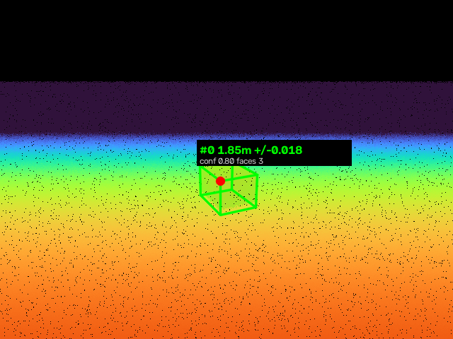

# boxrange

Measure the distance to a box from RealSense depth camera input.

Depth frame in, tracked metric distance out, ~29 FPS on a laptop CPU. No
training, no CAD model, no GPU.



## Does it work?

One command, no camera and no install needed — it puts a box at known
distances, measures it, and checks the answer against truth:

```bash
python -m boxrange --selftest
```

```
   truth   reported     error      +/-  size err  faces   conf   verdict
--------------------------------------------------------------------------
  0.998m     0.991m   -0.007m   0.005m    0.023m    3.0   0.80   ok
  1.873m     1.846m   -0.027m   0.018m    0.011m    3.0   0.80   ok
  2.831m     2.773m   -0.058m   0.035m    0.023m    3.0   0.80   ok
  3.812m     3.704m   -0.107m   0.050m    0.078m    2.3   0.52   ok
--------------------------------------------------------------------------
34.9 ms/frame (29 FPS) on this CPU

PASS -- ranging tracks ground truth.
```

Exit code is 0 on pass, 1 on failure, so it drops straight into CI.

## Quick start

Runs with no camera attached — the synthetic source renders a box with a
physically modelled stereo noise profile:

```bash
uv pip install -e ".[dev]"
python -m boxrange --frames 30 --distance 2.0
```

```
[   0] track 0  1.845 m +/- 0.018 (axial 1.843, centre 2.114, faces 3, conf 0.80)
[   1] track 0  1.847 m +/- 0.017 (axial 1.845, centre 2.114, faces 3, conf 0.80)
```

On hardware, nothing else changes:

```bash
python -m boxrange --source live --show          # live camera + overlay window
python -m boxrange --source live --record run.npz --frames 200
python -m boxrange --source npz --path run.npz --json
python -m boxrange --source bag --path scene.bag --json > ranges.jsonl
```

Library use:

```python
from boxrange import BoxRangePipeline, RealSenseSource

pipeline = BoxRangePipeline()
with RealSenseSource() as source:
    for frame in source:
        for det in pipeline.process(frame):
            print(det.range.surface_m, det.range.sigma_m, det.range.confidence)
```

## Which distance?

"Distance to the box" is ambiguous, and picking the wrong one is a real source
of bugs. All four are reported:

| field | meaning | use for |
|---|---|---|
| `surface_m` | Euclidean, camera to nearest point on the box | collision, stopping distance |
| `axial_m` | nearest box surface along +z | forward-driving robots (lateral offset shouldn't count) |
| `centroid_m` | Euclidean to box centre | grasping, handing a target to a planner |
| `measured_m` | robust nearest observed depth, model-free | cross-check; if it disagrees with `surface_m`, the fit is wrong |

Plus `sigma_m` (1-sigma), `confidence` (0–1), and `visible_faces`.

**Always read `sigma_m`.** Stereo range error grows as z², so a box at 4 m
carries ~16× the variance it does at 1 m. A bare float hides that.

## Measured accuracy

Synthetic scene, ground truth known exactly, 8 seeds per row, 0.40 × 0.30 ×
0.25 m box, D435-like intrinsics (fx=385, baseline 50 mm, 0.08 px subpixel):

| true | reported | bias | sigma | extent err | faces | conf |
|---|---|---|---|---|---|---|
| 1.0 m | 0.991 m | −0.007 m | 0.005 m | −0.023 m | 3.0 | 0.79 |
| 1.5 m | 1.400 m | −0.015 m | 0.010 m | −0.019 m | 3.0 | 0.80 |
| 2.0 m | 1.846 m | −0.026 m | 0.018 m | −0.011 m | 3.0 | 0.80 |
| 2.5 m | 2.307 m | −0.041 m | 0.026 m | +0.001 m | 3.0 | 0.80 |
| 3.0 m | 2.774 m | −0.058 m | 0.035 m | +0.019 m | 3.0 | 0.80 |
| 3.5 m | 3.241 m | −0.079 m | 0.044 m | +0.045 m | 2.9 | 0.69 |
| 4.0 m | 3.712 m | −0.099 m | 0.052 m | +0.067 m | 2.2 | 0.53 |
| 4.5 m | 4.190 m | −0.115 m | 0.058 m | +0.070 m | 2.0 | 0.39 |

### Known limitation: the bias is real

The error is **systematically negative and grows with range** — the pipeline
reads *nearer* than truth. Cause: depth noise inflates the fitted footprint
rectangle outward (a hull operation can only ever grow), which pushes the near
corner toward the camera. Percentile trimming removes most of it, not all.

Two consequences worth knowing:

- Reading near is the **safe** direction for obstacle avoidance, and it is why
  this is acceptable rather than fixed.
- Beyond ~3 m the bias **exceeds the reported sigma** (at 4.5 m: −0.115 m bias
  vs 0.058 m sigma). `sigma_m` describes noise, not this bias. Do not treat
  `interval_95` as covering truth at long range.

`test_range_bias_is_conservative_and_bounded` pins this so it cannot silently
worsen. These numbers come from the synthetic noise model; **re-run against a
real camera and a tape measure before trusting them**, since real D400 depth
also carries fixed-pattern and temperature-dependent error this model omits.

## How it works

```
depth frame
  └─ deproject              organised point cloud (invalid → NaN, not origin)
  └─ RANSAC ground plane    up-hint constrained, so a wall can't win the vote
  └─ subtract + cluster     connected components on the image grid,
                            with a range-adaptive depth-jump threshold
  └─ fit box on plane       one axis locked to the plane normal
  └─ range + uncertainty    four distances, sigma, confidence
  └─ track                  greedy nearest-centroid + EMA
```

Two decisions carry most of the accuracy:

**The box fit is plane-constrained.** Free 3D PCA is the obvious approach and
it's wrong here: a depth camera sees only one or two faces, so the point mass is
a hollow L-shell and the principal axes tilt off the true edges. Locking one
axis to the ground normal and recovering the other two from the footprint's
minimum-area rectangle gets the true edge directions from a single visible
corner.

**Every threshold scales with the sensor noise model, never absolute
millimetres.** A 5.7 cm fit residual is terrible at 1 m and textbook-perfect at
3.5 m, where the noise floor *is* 5 cm. An earlier absolute-threshold version
of `_confidence` scored distance as if it were error and silently dropped every
detection past 2.5 m.

## Do you need the GPU / the deep-learning models?

**For distance to a box: no.** A box is a cuboid primitive, and the RealSense
*measures* range directly. Regressing distance from RGB throws away the one
sensor that observes it. This pipeline needs no training data, no CAD model, no
labels, and runs real-time on CPU.

Where the referenced work does and doesn't fit:

- **EfficientPose** ([paper](https://arxiv.org/abs/2011.04307),
  [code](https://github.com/ybkscht/EfficientPose)) is **RGB-only** and
  instance-level — TensorFlow 1.15 / Python 3.7, trained per-object on
  Linemod-style annotated data. It never touches the depth stream. For distance
  it would be strictly worse *and* need you to label your specific box.
- **[FoundationPose](https://nvlabs.github.io/FoundationPose/)** is RGB-D and
  handles novel objects, but needs a CAD model or reference views plus CUDA and
  nvdiffrast.

They earn their place when you need something this pipeline genuinely cannot
do: **full 6D pose of a specific textured object**, boxes that aren't
resting on a visible support plane, heavy clutter/occlusion, or distinguishing
*which* box among several identical-looking ones. Geometry gives you a cuboid's
pose up to the symmetry of a cuboid; it cannot tell you which way the label
faces.

If you want that, the seam is already in place — `Detector` in
[`segment.py`](boxrange/segment.py):

```python
class Detector(Protocol):
    def detect(self, depth_m, intrinsics, color) -> tuple[list[Candidate], Plane | None]: ...
```

`RegionPriorDetector` adapts any RGB detector that emits pixel masks: the
network localises, depth still measures. That split is the point — keep the
metric on the sensor that measures metrically, and use the network only for the
semantics geometry can't supply.

## Layout

| file | role |
|---|---|
| [`intrinsics.py`](boxrange/intrinsics.py) | pinhole model + z² stereo noise model |
| [`geometry.py`](boxrange/geometry.py) | deprojection, RANSAC plane, plane-constrained box fit |
| [`segment.py`](boxrange/segment.py) | candidate segmentation, `Detector` seam |
| [`ranging.py`](boxrange/ranging.py) | the four distances, sigma, confidence |
| [`pipeline.py`](boxrange/pipeline.py) | orchestration + tracking |
| [`frames.py`](boxrange/frames.py) | RealSense / bag / npz / synthetic sources |
| [`viz.py`](boxrange/viz.py) | overlay rendering |
| [`cli.py`](boxrange/cli.py) | `python -m boxrange` |

## Notes

- `pyrealsense2` has no wheel for macOS arm64, so it's an optional extra
  (`pip install -e ".[realsense]"`). The synthetic and `.npz` paths run
  anywhere, which is how you develop on a laptop and validate on the rig.
- Record on the machine with the camera, analyse anywhere:
  `--record run.npz` then `--source npz --path run.npz`.
- Coordinate convention throughout is the depth optical frame: +x right,
  +y down, +z forward (OpenCV / RealSense).

```bash
pytest -q    # 23 tests, ~3 s
```
